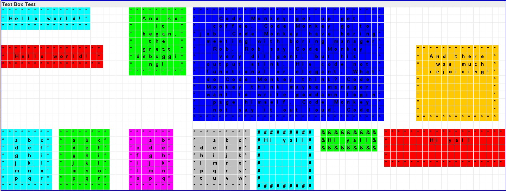
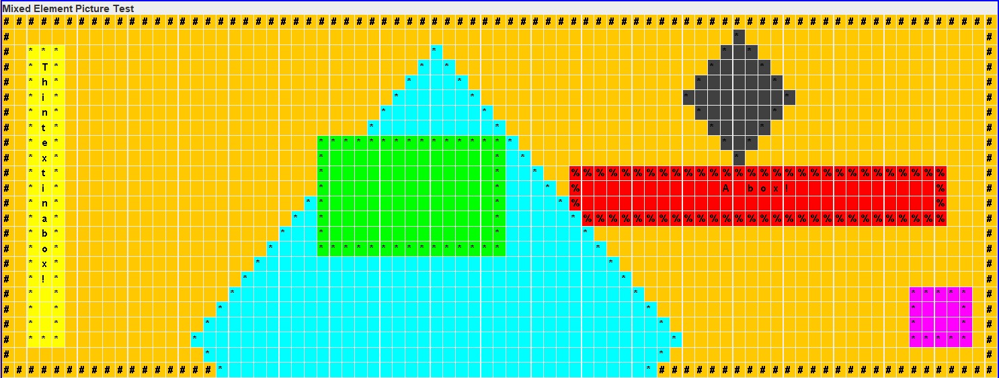

# Shapes
Creating shapes with Java Canvas.
Includes custom shapes of Rhombus, Rectangle, and TextBox.

## Installation
1. Download, install and run [IntelliJ Community Edition](https://www.jetbrains.com/idea/download/)
2. Click "Get from VCS" or File->New->Project From Version Control
3. Insert the following URL:
```
https://github.com/Tooo/Shapes.git
```
4. Run MainGUI

## Custom Shapes
### Rhombus
Draw a Rhombus with the X & Y coordinates on the top-left bounding box.
All four sides of a rhombus are the same.

### Rectangle
Draw a Rectangle with the X & Y coordinates on top-left corner of rectangle.
Width and height are the dimensions of the rectangle.

### TestBox
Draw a TextBox with drawing a rectangle and a message inside.
The message will be centre aligned and if the message is too long, it will be split across multiple lines.

## Picture Test
### Rectangle Picture


### Rhombus Picture


### Text Box Picture


### Mixed Element Picture


### Front and Back Picture


